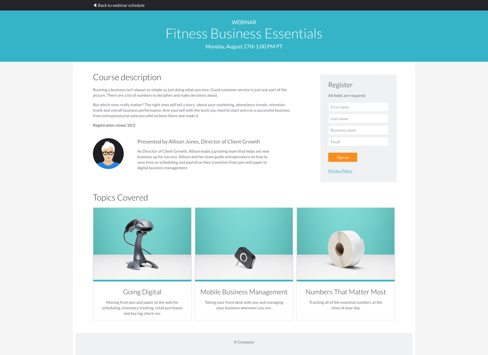

## Your challenge, should you choose to accept it

1. Clone this repo (or download the .zip archive) to get started

2. Your page should resemble [webinar_screenshot.png](webinar_screenshot.png) on desktop and be responsive down to mobile. This page was designed on a 12 column grid, and uses [Lato](https://fonts.google.com/specimen/Lato) font.

    
    
3. The Sign Up button should have a hover state and trigger form validation when clicked.

4. Add the current year before ‘Company’ in the footer.

5. When you're finished, send a link to your GitHub repo (preferred) or a .zip archive to your point-of-contact. (Make sure you include your unminified code!) If tooling is required (grunt, rails, yeoman, etc.), your submitted work should also be hosted so that it can viewed in a working state.

## What we're looking for

- **Attention to detail**. 
  Can you build a near-identical representation of the screenshot we provided? No detail is too small in our view.

- **Appropriate use of frameworks and tools**. You don't necessarily have to use the latest and greatest frameworks. As long as you use your preferred tools in an appropriate way and are able to describe your reasoning if asked, you're good to go.

## Help!
Should you stumble into any questions during your quest, feel free tor reach out to your recruiter or dev contact. There are no stupid questions!
